# Mapping the Met

# Project Description
This project seeks to identify biases and patterns in the Metropolitan Museum of Art's collecting practices by mapping the locations of their "Highlights" works. The Met "Highlights" are objects in the museum's collection that have been categorized as "popular or important." This type of subjective classification is prone to bias on the part of those who are selecting these works, and by mapping their locations of origins, we can determine if biases are present and if they are location- or culture-based. 

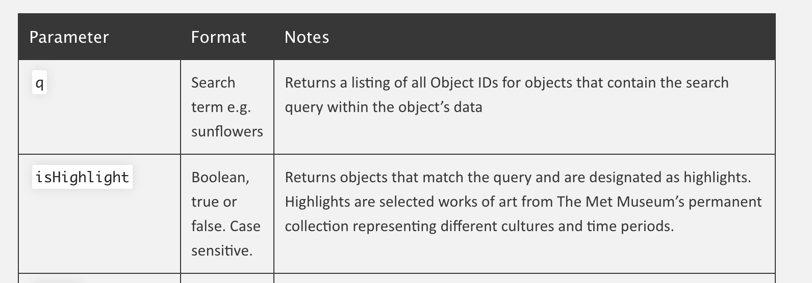 The Met API's description of its criteria for "Highlights" 

## Research Question
_Can mapping the locations of origin for the Met’s “Highlights” demonstrate biases or other patterns in the museum’s collecting and curation practices?_

# Rationale Statement
Museums' collecting and curation practices are inherently biased, especially at large museums with objects from a range of cultures. In the United States, museums often prioritize the display and study of works from white, Western societies. Through data visualization, this project attempts to determine whether the objects that the Met considers significant are mostly from these cultures, or if any other patterns emerge from the data.
# Workflow
This project uses the Metropolitan Museum of Art's API to map works' locations/cultures of origin via Google My Maps. My workflow for this project was as follows: 
1. Research Met API
2. Extract object data & create CSV files with data
3. Edit CSV files
4. Upload to Google My Maps

## Research Met API
Gaining an understanding of the Met API and its data is crucial to utilizing it properly. I found that the most direct way of analyzing potential bias in the Met's practices was by analyzing the objects that are considered the museums most "important" and determining their countries of origin. The Met's "Highlights," a collection of almost 3,000 objects, are listed in the API and searchable.

## Extract object data & create CSV files 
I created a dataframe with all of the "Highlights" objects and included the following information:
* Title
* Artist
* Artist gender
* Earliest & latest possible date of creation 
* Department
* Culture
* Country

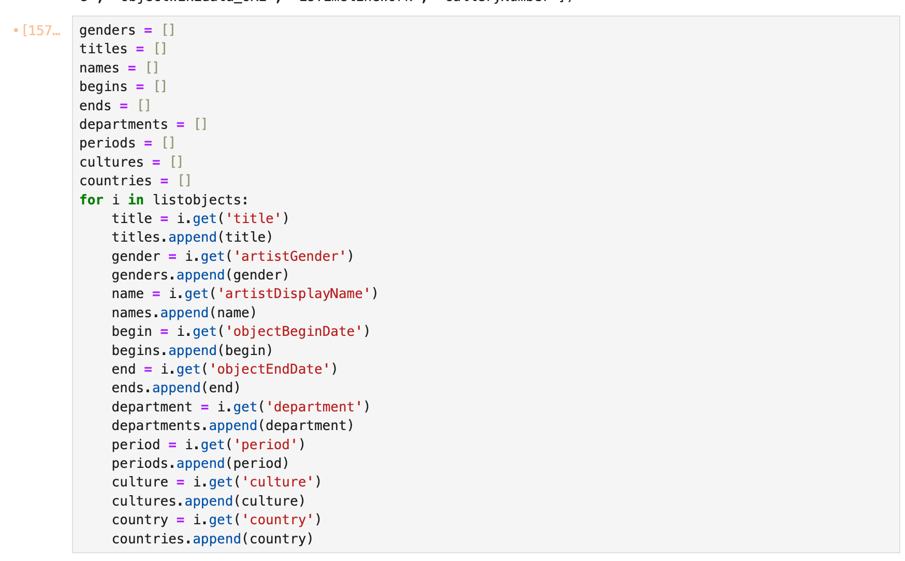
Creating a dataframe

I then filtered the data, removing all objects that did not have a country of origin listed. In a preliminary version, I also added ISO_Alpha3 country codes to the dataframe, in case this made mapping simpler. This was not necessary for Google My Maps, so I later deleted this column.

## Edit CSV Files

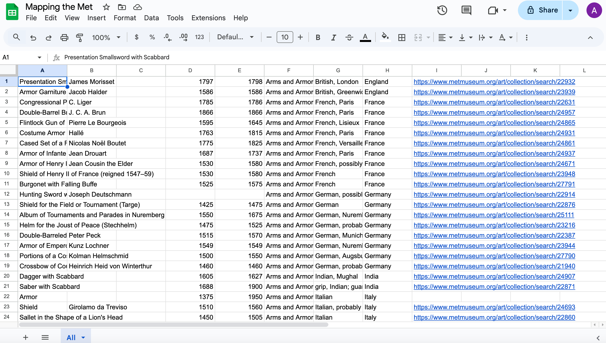
Manually editing the CSV file

In this step, I opened the CSV file on Google Sheets and looked over the object information to make sure it was correct. I also reformatted the file so that it looked cleaner in Google My Maps. I added object links to each object in the list so that a user can easily access it on the Met's website. Finally, I created a new set of CSV files with the objects separated by department. I found that it was crucial to manually edit and analyze the data, as each object has unique tombstone information and provenance. 

## Upload to Google My Maps
I created two Google My Maps with the data. The first has all of the objects in one layer, color-coded by department. The second has the objects divided into layers by department, so that objects from each department can be viewed as a group.

# Project & Findings

I created two maps, both of which illustrated trends in the museum's collecting practices. The most notable issue I identified was the absence of objects from countries in Africa and Central Asia.

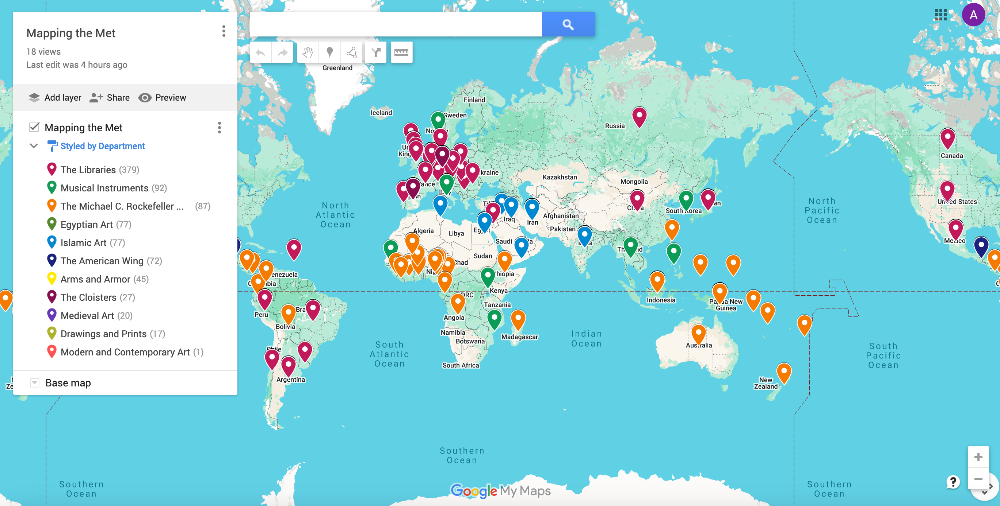
[Mapping the Met](https://www.google.com/maps/d/edit?mid=1Z_kh9Ygs5CHEwkHTZ6hOs6_4JVG7iiU&ll=0.8142718522168337%2C0&z=2)

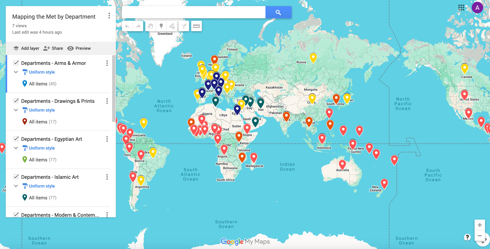
[Mapping the Met by Department](https://www.google.com/maps/d/u/0/edit?mid=1ubRvCLT54xNSAmxdD0RcaZeIrjXK13A&ll=3.724678106208671%2C0&z=2)

On both maps, a user can click on an object and view information about it, as well as access a link to the object's page on the Met's website.

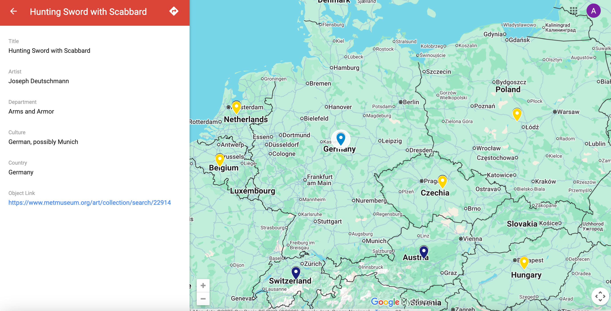
Tombstone information about an object 

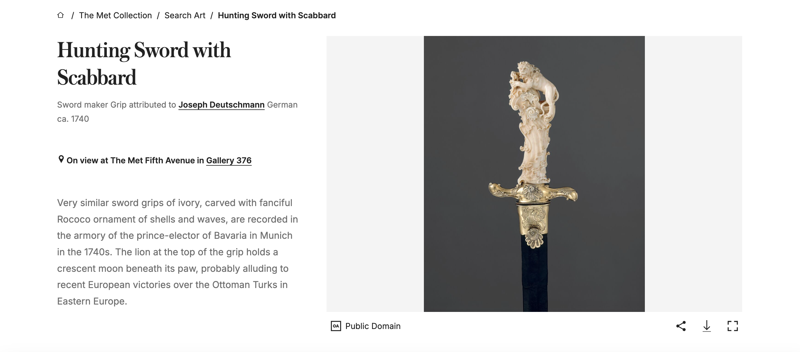
Met Museum's page for an object in its collection

Objects are also searchable by title if a user has a specific work they would like to locate on the map.

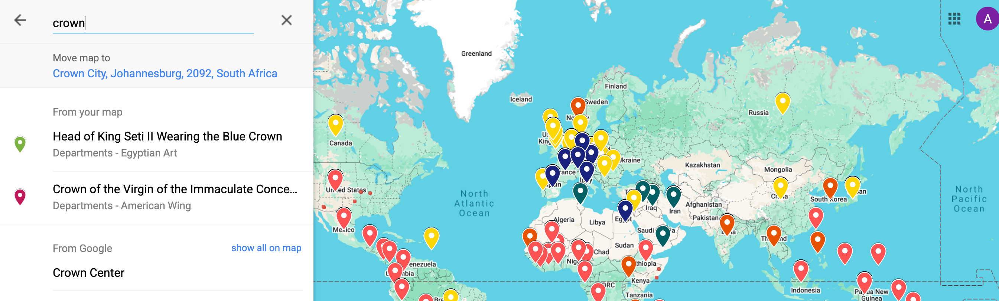

### Mapping the Met's "Highlights" brought several trends and issues to light. 

- **Over 1,000 “Highlights” lack country/culture information.**
Of 2,765 Objects in the API listed as “Highlights,” only 895 had country information. 

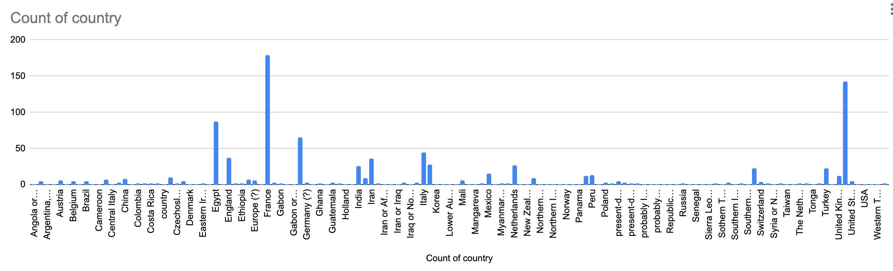
Chart showing the number of works from each country listed

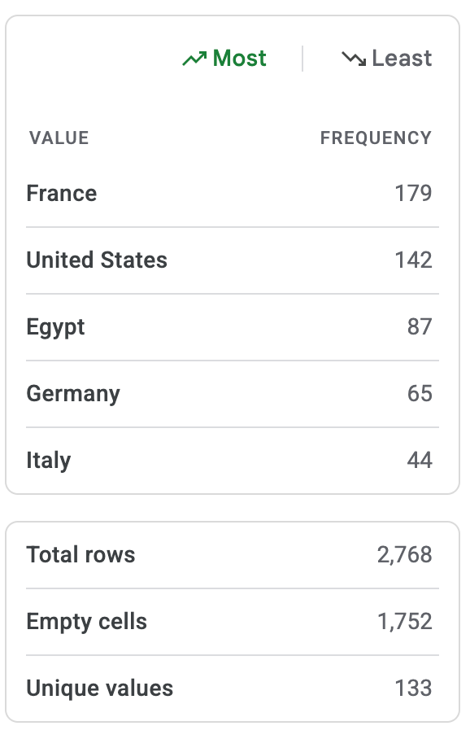
Countries with the most "Highlights" in the Met's collection.

**Some countries have no objects in the “Highlights” section at all.** This is especially true of countries in Central Asia and Africa. The United States and countries from Europe had the highest number of "Highlights", showing overrepresentation of white, Western cultures in this category.

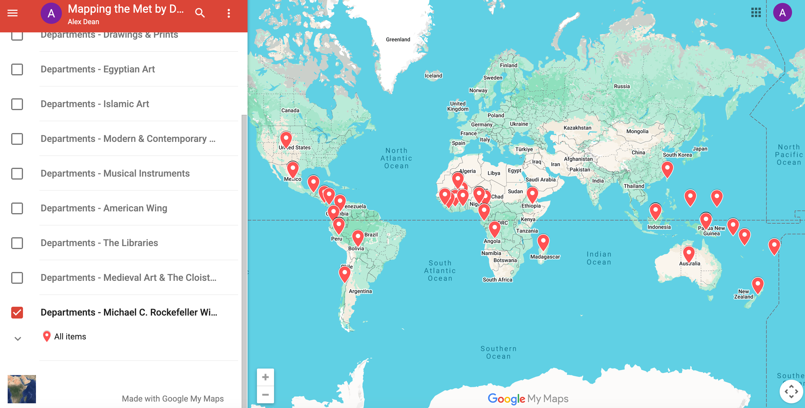
The countries represented in the Michael C. Rockefeller Wing

- **The Michael C. Rockefeller Wing encompasses many very different countries/cultures.**
31 countries across five continents are represented in the department. This curatorial decision could lead to generalizations and elisions of highly distinct cultures.

- **The Met’s data can be inconsistent, incomplete, and overly general.** Lots of objects were mislabeled, and the API's dating system means that any works created before 1 AD had negative numbers listed as their dates of creation (for example, a work created in 50 BCE would have its year of creation listed as -50).

- **Any museum data requires careful, manual review, ideally by field experts.** Culturally sensitive objects and information require careful review. While data management tools are useful for working with large amounts of object information, each work is unique and requires special attention; metadata and tombstone information should be created on a case-by-case basis.

# Further Uses / Future Directions

There are several pontential enhancements for this project:
- Research could be performed to determine more specific locations of origin for objects (rather than just grouping them by country).
- Contributions from cultural representatives could provide insights into the works' culture- and location-based classifications.
- Fine-grained data from cultural representatives and other experts could enhance other object metadata and tombstone information fields.
- The data could be used to create maps that reflect concentrations of objects in various locations.
- This data could also help determine other trends in the Met's collecting practices, such as the gender of the artists, cultural classifications, or the number of objects in each department.

# Files List
- **METcountries.ipynb**:
A python notebook with all of the code for creating a dataframe with Highlights from the Met API
- **mappingthemetMAP.csv**: A CSV file with all the Highlights in a dataframe, edited for clarity and compatibility with Google MyMaps
- **Department CSVs**: CSVs with all artworks sorted by department
